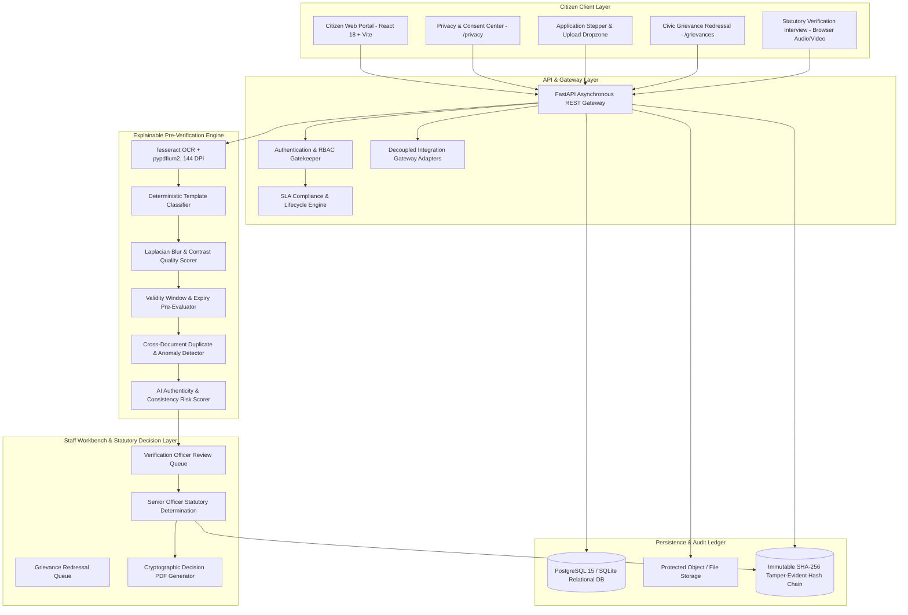

# SevaSetu — Technical Architecture & Operating Model

> **Statutory Civic Principle**:  
> *"AI assists verification. Final statutory decisions remain with authorized officers."*

---

## 1. High-Level Architecture



---

## 2. Core Architectural Subsystems

### A. Explainable Pre-Verification Pipeline
1. **OCR Extraction (`app/pipeline/ocr.py`)**: Multi-page PDF rendering via `pypdfium2` at 144 DPI and local optical character recognition via `pytesseract`.
2. **Deterministic Classifier (`app/pipeline/classifier.py`)**: Template signature analysis with negative keyword constraints preventing cross-document false matches.
3. **Quality & Validity Engine (`app/pipeline/quality.py`, `app/pipeline/validity.py`)**: Evaluates Laplacian variance (blur), brightness, and resolution while distinguishing lifetime identity records from time-bound utility bills.
4. **Authenticity Risk Scorer (`app/pipeline/authenticity_risk.py`)**: Generates non-binding consistency indicators (**LOW** / **MEDIUM** / **HIGH**) without autonomous rejection.

### B. Two-Tier Staff Review & Decision Support
- **Verification Officer**: Conducts side-by-side evidence inspection, requests document corrections, and unlocks the statutory interview gate (`INTERVIEW_ELIGIBLE`).
- **Senior Officer**: Evaluates citizen interview consistency transcripts and issues official statutory determinations (`APPROVED` with digital certificate PDF or `REJECTED` with formal decision notice PDF).

### C. Civic Grievance & Escalation Engine (`app/grievances.py`)
- Formal 8-state statutory workflow: `OPEN` $\to$ `ACKNOWLEDGED` $\to$ `ASSIGNED` $\to$ `UNDER_REVIEW` $\to$ `AWAITING_CITIZEN` $\to$ `ESCALATED` $\to$ `SENIOR_REVIEW` $\to$ `RESOLVED` $\to$ `CLOSED`.
- Staff-only internal notes isolated via server-side authorization.
- Guardrails capping statutory reconsideration attempts at maximum 2 requests per grievance.

### D. Privacy, Consent & Retention Governance (`app/pipeline/privacy_consent.py`, `app/pipeline/retention.py`)
- Purpose-bound structured consent tracking (`APPLICATION_PROCESSING`, `OCR_PREVERIFICATION`, `NOTIFICATIONS`, `ANALYTICS_FEEDBACK`).
- Non-destructive retention lifecycle protecting immutable audit evidence while safely redacting expired payload text.

### E. Cryptographic Audit Ledger (`app/pipeline/audit_trail.py`)
- Every status transition, document versioning event, staff assignment, and grievance action generates a cryptographically linked SHA-256 hash record.

---

## 3. Decoupled Integration Gateway

```
SevaSetu Platform
       │
   [Integration Gateway]
       ├── Sandbox Identity Provider (Local Checksum & Structure)
       ├── Sandbox Document Provider (DigiLocker Adapter)
       └── Future Government Authority Gateway (UIDAI / State e-Governance)
```
*Note: Default configuration runs local sandbox providers without fabricating real external government connections.*

---

## 4. Database Schema Management & Runtime Reconciliation

- **Automated Startup Reconciliation**: In local development and demo environments (SQLite), the application dynamically introspects all tables declared in `Base.metadata.tables` and executes non-destructive `ALTER TABLE ADD COLUMN` operations for any missing columns without data loss.
- **Fail-Fast Integrity Verification**: Post-migration, `verify_schema_integrity()` confirms 100% column alignment between ORM models and the physical database. Any discrepancy immediately halts startup with structured logging.
- **Production Guidance**: Enterprise PostgreSQL deployments should utilize formal version-controlled migration pipelines (such as Alembic).
