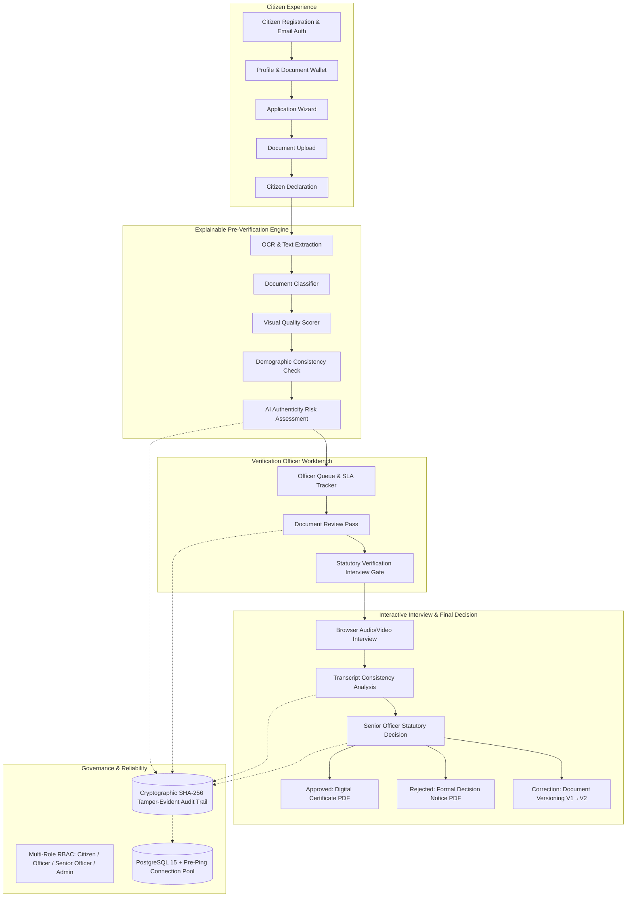

# SevaSetu Civic Document Pre-Verification Platform — Demo Guide & Architecture

> **CORE STATUTORY PRINCIPLE**:
> *"AI assists verification. Final statutory decisions remain with authorized officers."*

---

## 1. System Architecture & Component Overview



### Core Architecture Pillars:
1. **AI-Assisted Pre-Verification**: Extracts text via Tesseract OCR, classifies civic document types (Aadhaar, Ration Card, Birth Certificate, Electricity Bill), inspects image sharpness/dpi quality, validates demographic consistency, and flags authenticity risk indicators (**LOW** / **MEDIUM** / **HIGH**).
2. **Human Officer Review**: AI never auto-rejects or auto-approves applications. Designated verification officers inspect flagged discrepancies, request specific document corrections, or approve document evidence.
3. **Statutory Verification Interview**: Real-time browser interview gate verifying applicant knowledge against submitted document credentials with 5 statutory questions and automated consistency scoring.
4. **Cryptographic Audit Trail**: Every status transition, document versioning event, and officer decision generates an immutable SHA-256 hash-chained `AuditEvent` record.
5. **Document Versioning**: Corrected documents are versioned atomically (**Version 1** $\to$ `ARCHIVED_REPLACED`, **Version 2** $\to$ `ACTIVE`) with rerun pre-verification.
6. **SLA Monitoring**: Computes real-time statutory deadlines (e.g. 7 days for income certificate, 15 days for caste certificate) with `NORMAL`, `APPROACHING_SLA`, and `OVERDUE` tracking.

---

## 2. Startup Commands & Clean Demo Reset

### A. Launch Multi-Container Application Stack
```bash
# Clone or navigate to the project root
cd sevasetu-final

# Start all services (PostgreSQL, FastAPI Backend, React Frontend)
docker compose up --build -d
```

### B. Verify System Health & Readiness
```bash
# Check backend health and database connectivity
curl http://localhost:8000/api/health

# Output:
# {"status":"ok","database":"healthy","app_name":"SevaSetu","version":"1.1.0"}
```

- **Frontend Application**: `http://localhost:3000`
- **Backend API Docs (Swagger UI)**: `http://localhost:8000/docs`

### C. Clean Demo Database Reset Procedure
To reset the database to a clean, seeded demonstration state:
```bash
# Run automatic schema initialization and demo seed
curl -X POST http://localhost:8000/api/retention/run -H "Authorization: Bearer <ADMIN_TOKEN>"
```

---

## 3. Seeded Demo Accounts & Credentials

| Role | Username | Password | Purpose |
| :--- | :--- | :--- | :--- |
| **Verification Officer** | `officer1` | `seva123` | Inspects applications, requests corrections, approves document evidence for interview. |
| **Senior Officer** | `senior_officer1` | `seva123` | Reviews completed interviews, overrides risks, issues final statutory approval/rejection. |
| **Administrator** | `admin1` | `seva123` | Manages staff accounts, modifies roles, monitors system-wide audit trail. |
| **Demo Citizen** | Self-registered via UI | Chosen at signup | Explores service catalog, creates applications, conducts interview, downloads certificates. |

---

## 4. Citizen Flow (Live Demo Walkthrough)

1. **Register Account**:
   - Navigate to `http://localhost:3000` $\to$ click **Citizen Sign In** $\to$ select **Register**.
   - Enter Full Name (e.g., `Rajesh Sharma`), Email, and Password.
2. **Verify Email & Login**:
   - Confirm verification status $\to$ log into Citizen Portal.
3. **Complete Citizen Profile**:
   - Open **My Profile & Mobile** $\to$ fill Date of Birth (`1988-06-15`), District, State, and Phone.
4. **Create Application**:
   - Click **Start Application** $\to$ select **Income Certificate** (or **Ration Card**, **Caste Certificate**).
5. **Upload Required Documents**:
   - Upload Aadhaar card and Income proof (or choose pre-verified items from **My Documents** wallet).
6. **Submit Application**:
   - Check legal declaration checkbox $\to$ click **Submit Application**.
   - Instantly view **Readiness Score** ($\ge 85$), classified document types, and **Authenticity Risk: LOW**.
7. **Receive In-App Notification**:
   - Click top navigation **Notifications (1)** $\to$ view submission confirmation and tracking link.
8. **Start Verification Interview**:
   - Open application tracking page $\to$ click **Start Verification Interview** once unlocked by officer.
9. **Complete Interview**:
   - Answer all 5 statutory questions confirming identity and submitted document details.
10. **View Final Decision**:
    - Monitor real-time status transition to **APPROVED**.
11. **Download Official Certificate**:
    - Click **Download Decision Certificate (PDF)** to receive the generated, signed civic certificate.

---

## 5. Officer Flow (Live Demo Walkthrough)

1. **Officer Login**:
   - Navigate to top-right **Staff Login** $\to$ enter `officer1` / `seva123`.
2. **Productivity Dashboard**:
   - View SLA metrics, daily processed count, and pending review workload.
3. **Officer Review Queue**:
   - Filter queue by **Income Certificate** or search by citizen name / Reference ID.
4. **Open Application**:
   - Click **Review Application** on the pending case.
5. **Inspect Documents & Risk Assessment**:
   - Inspect side-by-side OCR text, image quality score, and authenticity risk breakdown.
6. **Assign Application**:
   - Click **Assign to Me** to take ownership of the case.
7. **Pass Document Review (Interview Gate)**:
   - Click **Pass Document Review & Unlock Interview** $\to$ status transitions to `INTERVIEW_ELIGIBLE`.
8. **Senior Officer Final Review**:
   - Log in as `senior_officer1` / `seva123` $\to$ inspect citizen interview transcript and consistency score.
9. **Issue Final Statutory Decision**:
   - Select **Approve Application** $\to$ choose Reason Category (`ALL_REQUIREMENTS_FULFILLED`) $\to$ enter Officer Remarks $\to$ click **Confirm Statutory Approval**.

---

## 6. Administrator Flow (Live Demo Walkthrough)

1. **Admin Login**:
   - Log in as `admin1` / `seva123`.
2. **Staff Management**:
   - Navigate to **Manage Staff** $\to$ view active roster of officers and administrators.
3. **Role Management**:
   - Create a new staff account or promote an Officer to Senior Officer.
4. **Sole-Admin Lockout Protection**:
   - Attempt to demote `admin1` while sole admin $\to$ system immediately blocks action with clear error message: *"Cannot demote sole active administrator"*.
5. **Audit Trail Inspection**:
   - Open **Admin Settings** $\to$ view cryptographic audit chain verifying SHA-256 event integrity.

---

## 7. Civic Grievance, Support & Escalation Flow (Live Demo Walkthrough)

1. **Citizen Lodges Grievance**:
   - From any Application Status page (`/status?id=...`) or from **Grievance Redressal** (`/grievances`), click **Lodge Grievance**.
   - Select Category (e.g. `Decision Dispute`, `Document Rejected`, `Application Delayed`), enter Subject, Description, and optional Evidence Attachment.
   - Click **Submit Grievance** $\to$ immediately receive a non-sequential reference ID: `SS-GRV-2026-XXXXXX` and in-app confirmation.

2. **Officer Queue & Investigation**:
   - Log in as `officer1` / `seva123` $\to$ open **Grievance Queue** (`/officer-grievance-queue`).
   - Filter by Category / Status $\to$ click **Review** on the case.
   - Click **Acknowledge Case** $\to$ status transitions to `ACKNOWLEDGED`.
   - Click **+ Staff Internal Note** to record private notes (e.g. *"Checking tax portal for income bracket verification"*) $\to$ note is visible to staff only and strictly hidden from citizen.
   - Click **Request Clarification** $\to$ enter question for citizen $\to$ status transitions to `AWAITING_CITIZEN`.

3. **Citizen Response**:
   - Citizen receives notification $\to$ opens `/grievances/:id` $\to$ types reply and submits $\to$ case automatically resumes to `UNDER_REVIEW`.

4. **Escalation & Statutory Resolution**:
   - Officer or Senior Officer clicks **Escalate to Senior Officer** with priority `HIGH`.
   - Senior Officer inspects audit history $\to$ clicks **Issue Formal Resolution** $\to$ enters statutory resolution notes and category (`DECISION_REVISED` / `ISSUE_CLARIFIED`).
   - Case transitions to `RESOLVED` $\to$ Citizen receives notification with resolution summary.

5. **Citizen Reconsideration / Close**:
   - Citizen can click **Request Reconsideration** (up to 2 times) if dissatisfied, or click **Close Grievance** to mark the case resolved.

---

## 8. Privacy & Operations Transparency Flow (Live Demo Walkthrough)

1. **Citizen Privacy & Consent Center**:
   - Navigate to `/privacy` $\to$ view complete transparency disclosures on **What We Collect**, **Why We Collect It**, and **Who Can Access It**.
   - Review the official AI safety boundary statement: *"AI assists verification. Final statutory decisions remain with authorized officers."*
   - Manage purpose-bound consents (e.g. withdraw optional Lifecycle Notifications or Quality Analytics permissions).

2. **Administrator Operations Monitoring**:
   - Log in as `admin1` / `seva123` $\to$ open `/operations` (or `/admin-operations`).
   - View real-time database latency, active connection pool state, and subsystem statuses.
   - Inspect live pipeline workload counts, SLA compliance breakdown, and total tamper-evident SHA-256 audit logs.
   - Test decoupled identity verification sandbox adapter in real time.

---

## 9. Known Environmental Boundaries & Graceful Degradation

- **Email Delivery (Resend API)**: In offline/demo environments without live `RESEND_API_KEY`, the system logs notifications safely to the in-app notification center without crashing.
- **WebRTC Camera/Mic**: If the demo device lacks a camera/microphone, the verification interview UI automatically presents a keyboard-accessible fallback text entry mode.
- **Local SQLite / Production PostgreSQL**: The application auto-detects database dialect and enforces connection pool pre-pinging on both SQLite and PostgreSQL.
