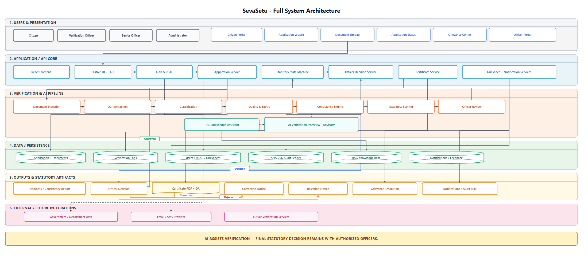

# SevaSetu — Software Design Documentation (Review 2 / DA2)

This directory contains the software architecture, design principles, system models, and user interface specifications for **SevaSetu**, an automated civic document pre-verification and case-management platform.

---

## 1. Directory Structure

```text
design/
├── SevaSetu_Software_Design_Document.pdf   # Complete academic design document (9 pages)
├── SevaSetu_Software_Design_Document.docx  # Word source document
├── architecture.drawio                    # Native, editable Draw.io XML architecture diagram
├── architecture.png                       # High-resolution export of the system architecture
├── README.md                              # This design guide & architecture specification
└── ui/                                    # High-fidelity desktop UI screens
    ├── 01_citizen_home.png                # Citizen Home / Service Selection & Grievance
    ├── 02_document_upload.png             # Civic Document Upload & Pre-Verification Checklist
    ├── 03_application_status.png          # Application Status, Lifecycle Timeline & Verification Badge
    ├── 04_officer_dashboard.png           # Officer Queue, Readiness Filter & SLA Metrics
    ├── 05_application_review.png          # Officer Split-Screen Review, OCR Extraction & Decision Action
    └── 06_grievance.png                   # Grievance Submission, SLA Tracking & Case Resolution
```

---

## 2. High-Level Architecture

SevaSetu adopts a **Layered Multi-Tier Architecture with a Modular Verification Pipeline** that cleanly separates citizen-facing self-service, administrative decision-making, automated document processing, and immutable persistence.



### Architectural Tiers:
1. **Tier 1: Users & Channels**:
   - Citizen Portal, Multi-Step Application Wizard, Document Upload, Application Status Tracker, and Grievance Center.
   - Dedicated Verification Officer and Senior Administrator Portals.
2. **Tier 2: Application / API Core (FastAPI & RBAC)**:
   - Stateless REST API gateways with role-based access control (`ROLE_CITIZEN`, `ROLE_OFFICER`, `ROLE_ADMIN`).
   - `ApplicationService` handles case intake and coordination.
   - `StatutoryStateMachine` enforces deterministic, non-bypassable legal lifecycle transitions.
   - `OfficerDecisionService` records human statutory rulings with cryptographic attestation.
   - `CertificateService` renders digitally signed completion certificates with verifiable SHA-256 QR codes.
3. **Tier 3: Modular Verification & Advisory Pipeline**:
   - **Ingestion & Validation**: Format validation, magic bytes verification, and payload sanity checks.
   - **OCR Extraction**: Text and tabular field extraction via Tesseract with development host fallback (`ocr.py`).
   - **Classification**: Document type classification using multi-evidence rules in `DOCUMENT_RULES` (`classifier.py`).
   - **Quality & Expiry**: OpenCV/PIL Laplacian variance blur estimation, brightness evaluation, and expiration parsing (`quality.py`).
   - **Consistency Engine**: Multi-document cross-field alignment using RapidFuzz string matching and digit validation (`consistency.py`).
   - **Readiness Scoring**: Rule-based weighted pre-verification composite readiness score (0–100%) in `scoring.py`.
   - **Officer Review**: Advisory presentation for the final human reviewer.
   - **AI Advisory Support**: Offline RAG Knowledge Assistant fusing BM25Okapi and TF-IDF vectors via Reciprocal Rank Fusion (`rag.py`), plus optional AI Verification Interview — **strictly decision-support only**.
4. **Tier 4: Data & Immutable Persistence**:
   - PostgreSQL / SQLite application database for cases, documents, profiles, and grievances.
   - Verification logs and execution telemetry.
   - SHA-256 tamper-evident audit ledger with hash chaining recording every state change and review decision.
   - Local ChromaDB vector database knowledge base for citizen query grounding.
5. **Tier 5: Outputs & Statutory Artifacts**:
   - Readiness & Consistency Diagnostic Reports.
   - Statutory Officer Decisions (Approved / Correction Requested / Rejected).
   - Tamper-Evident Certificate PDF with dynamic ReportLab vector QR code.
   - Correction and Rejection Notices with specific remedial instructions.
   - Grievance resolutions and multi-channel audit trail notifications.
6. **Tier 6: External / Future Integration Adapters (Sandbox & Extension Points)**:
   - Decoupled sandbox adapters for identity verification and citizen consent management.
   - Multi-channel notification gateway adapters (Email / SMS dispatch abstraction).
   - Extension interfaces for future civic certificate catalogs and schema definitions.

> **Core Governance Principle:**  
> **"AI ASSISTS VERIFICATION — FINAL STATUTORY DECISION REMAINS WITH AUTHORIZED OFFICERS."**  
> Automated pre-verification algorithms, OCR extraction, and AI interview assistants produce advisory readiness scores and highlight discrepancies. The platform strictly prohibits automated approval or rejection; all binding statutory determinations require an authenticated human officer's signed decision.

---

## 3. User Interface Design & Figma Prototype

The user interface is designed in Figma adhering to accessibility-conscious design guidelines, progressive disclosure, and dual-role ergonomic principles.

- **Figma Design File**: [SevaSetu Desktop UI Prototype](https://www.figma.com/design/LbHzS4ErAfeXeOLJIQDAN6/sevasetu?node-id=0-1&p=f)

### Included Screens:
| Screen | File | Primary Responsibility |
|---|---|---|
| **01 Citizen Home** | [`ui/01_citizen_home.png`](ui/01_citizen_home.png) | Service catalog, certificate applications, grievance shortcut, and status lookup. |
| **02 Document Upload** | [`ui/02_document_upload.png`](ui/02_document_upload.png) | Step-by-step checklist, drag-and-drop ingestion, format validation, and readiness feedback. |
| **03 Application Status** | [`ui/03_application_status.png`](ui/03_application_status.png) | Visual progress stepper, pre-verification score, officer notes, and remedial actions. |
| **04 Officer Dashboard** | [`ui/04_officer_dashboard.png`](ui/04_officer_dashboard.png) | Filterable application queue, readiness indicators (High / Medium / Low), and SLA timers. |
| **05 Officer Review** | [`ui/05_application_review.png`](ui/05_application_review.png) | Dual-pane comparative view: original document vs. OCR extracted text, discrepancy alerts, and decision buttons. |
| **06 Grievance Center** | [`ui/06_grievance.png`](ui/06_grievance.png) | Citizen grievance ticketing, automated SLA countdown, department routing, and audit resolution. |

---

## 4. Design Principles Applied

1. **Abstraction**: Verification logic and storage layers are decoupled behind clean interfaces (`extract_text_from_image`, `get_db`), allowing mock, local, or cloud implementations without altering core routing.
2. **Modularity**: The verification pipeline comprises isolated, single-responsibility modules (`ocr.py`, `classifier.py`, `quality.py`, `consistency.py`, `scoring.py`).
3. **High Cohesion**: Modules encapsulate tightly related business operations. For example, `StatutoryStateMachine` encapsulates solely state transition rules, guards, and SLA calculations.
4. **Low Coupling**: Communication between tiers occurs strictly through typed Pydantic schemas, dependency injection, and REST contracts, preventing leaky abstractions.

---

## 5. Editing the Diagrams

To inspect or edit the system architecture diagram:
1. Open [diagrams.net (Draw.io)](https://app.diagrams.net).
2. Click **Open Existing Diagram** and select `design/architecture.drawio`.
3. All swimlanes, services, databases, connectors, and badges are fully native and independently editable.
